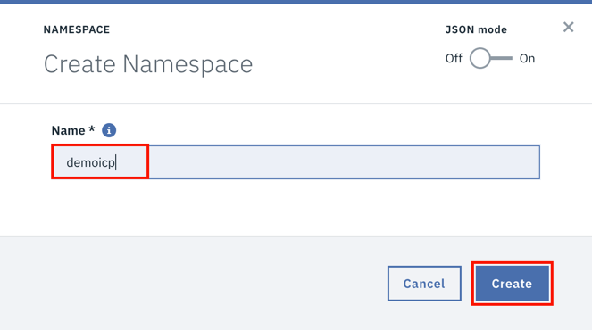
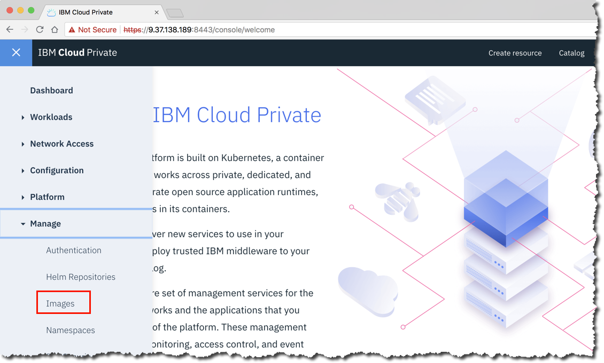
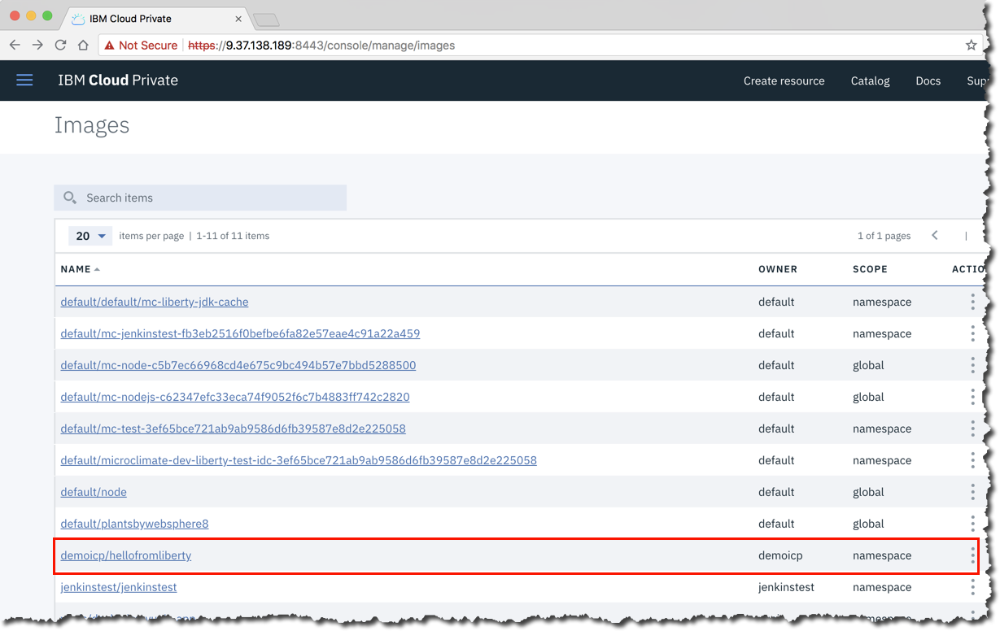

Lab - Push Docker Images to the ICP Private Docker Registry
---

### Table of contents
[1. Overview](#login)

[2. Preparing to build a Docker image](#prepthebuild)

[3. Build a Docker image](#buildanimage)

[4. Prepare to push the Docker image to the ICP Private Docker Registry](#prepthepush)

[5. Push a Docker image to the ICP Private Docker Registry](#pushtheimage)

## Overview <a name="Overview"></a>
In this lab exercise, you use a Java application that is packaged as a WAR file, and build a Docker container that combines the official IBM WebSphere Liberty Docker image with the application WAR file. Then, you log in to the ICP Private Docker Registry, and push the custom Docker image to the registry.

## Preparing to build a Docker image <a name="prepthebuild"></a>
You start with an application WAR file (HelloFromLiberty.war) that has already been created for you. This application is very simple, and  contains a single JSP that, when run, prints the message "Hello World from Liberty on IBM Cloud Private" in your browser.

1. Login to the `master` node as **root**. 

2. Make a directory called "HelloFromLiberty" to hold all of the components that you use to build your Docker image and then change your current location to the new directory:

```
mkdir HelloFromLiberty
cd HelloFromLiberty
```
For this lab, you will add 2 files to this new directory.

3.  Use the following command to copy the HelloFromLiberty.war file into the HelloFromLiberty directory that you just created.  
```
curl -O https://raw.githubusercontent.com/jdiggity22/rtp-bootcamp/master/Labs_development/Assets/privateregistry/HelloFromLiberty.war
```

This WAR file contains the simple Java Server Page (JSP) in the following image.


4. Use vi or another Linux text editor of your choice to create a file in the HelloFromLiberty directory with the name "Dockerfile" that contains the following two lines:

```
FROM websphere-liberty
COPY HelloFromLiberty.war /config/dropins/HelloFromLiberty.war
```

5. When you are finished, your directory should look like this:

```
drwxr-xr-x   2 root root 4096 Jun  3 17:32 .
drwx------  26 root root 4096 Jun 15 14:52 ..
-rw-r--r--   1 root root  380 Jun  3 17:32 Dockerfile
-rw-r--r--   1 root root  380 Jun  3 17:55 HelloFromLiberty.war
```

## Build a Docker image <a name="buildanimage"></a>

1. Make sure that you are in the HelloFromLiberty directory, and then run the Docker `build` command:

`docker build -t demoicp/hellofromliberty:v1.0 .`

You will see results that resemble the following:


The `-t` option in the above build command instructs Docker to add a `tag` to the image that it builds.  The "." indicates that the Dockerfile to use to build the Docker image is located in the current directory.  After the Docker image is successfully created, you do not see the resulting image in the current directory. Docker build stores the newly created Docker image in the `local` Docker repository.  The `local` Docker repository is a repository that resides on the server on which you execute the Docker build command.

2. After the build is complete, use the Docker `images` command to view the contents of the local Docker repository.

```
root@icp2103master:~/HelloFromLiberty# docker images | grep demoicp
Demoicp/hellofromliberty        V1.0            ba9688d28a08        3 minutes ago.        511MB
```

## Prepare to push the Docker image to the ICP Private Docker Registry <a name="prepthepush"></a>

Before you can successfully push a Docker image to the ICP Private Docker Registry, there are two things that you must do to prepare:

1. ICP must have a namespace that matches the name of the repository within the registry that you are storing the Docker image in.
2. The Docker image must be prefixed with the URI for the ICP Private Docker Registry.

### Create a Namespace in ICP

Recall from above that when you built the Docker image, the tag that is assigned to it contains the repository name `demoicp`.  You musto make sure that ICP has a matching namespace defined. If there is no namespace in ICP that corresponds to the repository in the ICP Private Docker Registry, then you get an authentication error when you attempt to push your Docker image.

1. Log in to the ICP console as admin/admin, and from the navigation menu, select **Manage -> Namespaces**.


2. Scroll through the list of namespaces defined in ICP, and confirm that there is no namespace with the name `demoicp`.  If there is an existing namespace by that name, then you are done with this step, and you can log out.  

3. If there is no namespace with the name `demoicp`, create one by clicking **Create Namespace**


4. In the pop-up window, enter the name of the new namespace, `demoicp` and click **Create**



5. After the namespace is created, confirm that it appears in the list of available namespaces.


### Add the Registry URI to the Docker Image Tag

To successfully push a Docker image to the ICP Private Docker Registry, the image tag must conform to the correct format, as follows:

	<Registry URI>/<Repository Name>/<Image Name>:<Image Version>

The tag that you attached to the Docker image when you created it does not contain the registry URI as a prefix.  Before you can push the Docker image to the registry, you must add another tag to the image. A Docker image can be tagged with an any number of tags, so in this case, so you can add a tag, rather than rename one.  

1. Use the following Docker `tag` command to add a tag to the Docker image:

`docker tag demoicp/hellofromliberty:v1.0 mycluster.icp:8500/demoicp/hellofromliberty:v1.0`

Once again review the results using the `image` command:

```
root@icp2103master:~/HelloFromLiberty# docker images | grep demoicp
demoicp/hellofromliberty                    V1.0           ba9688d28a08        18 minutes ago.        511MB
Mycluster.icp:8500/demoicp/hellofromliberty V1.0           ba9688d28a08        18 minutes ago.        511MB
```

## Push a Docker image to the ICP Private Docker Registry <a name="pushtheimage"></a>

You created a Docker image, prepared the image for the ICP Private Docker Registry, and prepared ICP to receive the image.  The final two steps in the process are:

1. Authenticate with the ICP Private Docker Registry.
2. Push your Docker image to the registry.

### Authenticate to the ICP Private Docker Registry

1. Authenticate to the ICP Private Docker Registry. Use the Docker `login` command shown below with your ICP console credentials (admin/admin):

```
root@icp2103master:~/HelloFromLiberty# docker login https://mycluster.icp:8500
Username (admin): admin
Password:
Login Succeeded
```

### Push a Docker image

Now that everything is ready and you authenticated to the ICP Private Docker Registry, you can push your Docker image to the registry.

1.  Run this command to push the Docker image to the registry.

`docker push mycluster.icp:8500/demoicp/hellofromliberty:v1.0`

The results should resemble the following:


2. Confirm that the new Docker image is successfully pushed to the ICP Private Docker Registry. Log in to the ICP console, and confirm that the new image appears in the list of available Docker images. From the menu, select **Manage -> Images**



3. The Docker image should appear in the list of available Docker images.



Congratulations! You successfully created a Docker image, and installed it in the ICP Private Docker Registry.

## End of Lab Review
  In this lab exercise, you learned how to:
  1. Prepare the directories and files required to build a Docker image.
  2. Build a Docker image with the Docker "build" command.
  2. Prepare ICP to accept a Docker image in the Private Docker Registry.
  3. Authenticate with the ICP Private Docker Registry and push a new Docker image into the registry.

## End of Lab Exercise
